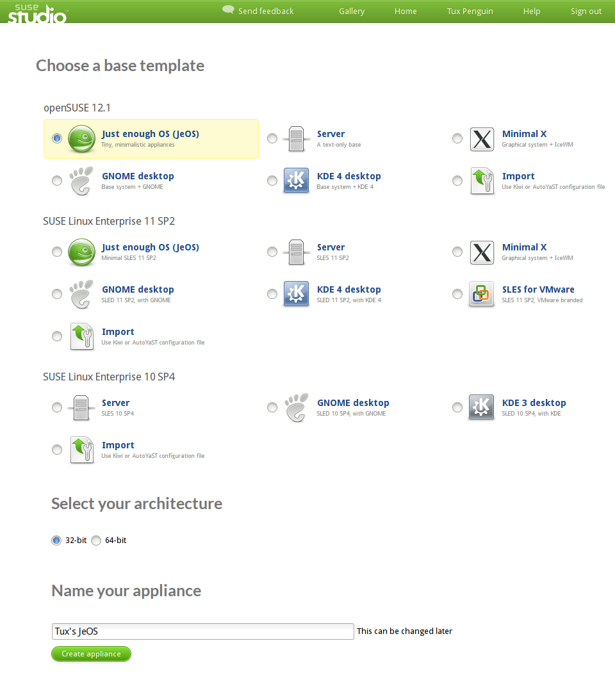
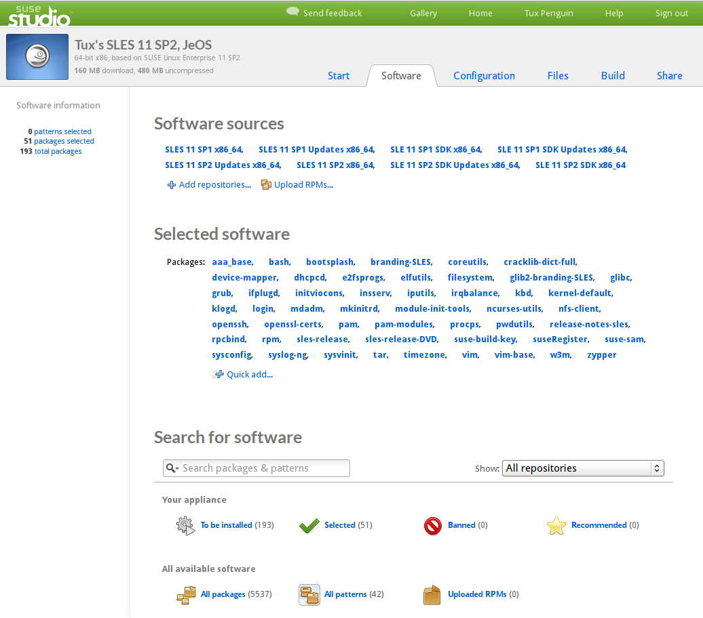
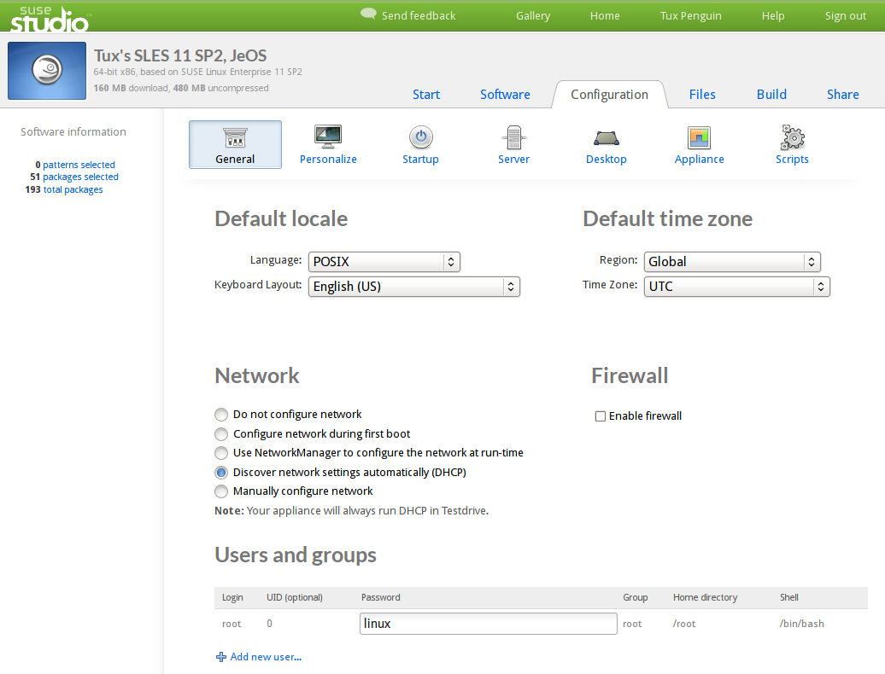

# Getting Started

To build software appliances, follow these steps:

## 1. Log In

Log in to your default SUSE Studio Web site given to you by your system administrator.

## 2. Choosing a Base Template.

The base template determines the operating system where your appliance is based upon. This can be any of the openSUSE, SUSE Linux Enterprise Desktop, or SUSE Linux Enterprise Server flavours for a 32- or 64-bit processor architecture depending on the server configuration.

## 3. Adding Software

Optionally extend the chosen base template with additional software from either your standard source or from an openSUSE repository. For more explanations, see Section 2, “Adding Software”.

## 4. Configuring Your Appliance

Personalize the appearance, locale, network, logo, background and other settings of your appliance.

## 5. Creating Your Appliance

Build the appliance in different formats like ISO, USB stick, hard disk image, VMware/VirtualBox image, or as Xen guests.

## 6. Testing Your Appliance

With the "testdrive" of SUSE Studio start a test session in your browser and optionally log in with SSH, or VNC. This is very helpful as it avoids excessive downloads and you can test your appliance immediately.

## 7. Downloading Your Appliance

After a successful build, download the appliance and deploy it on your hardware or virtual machine.