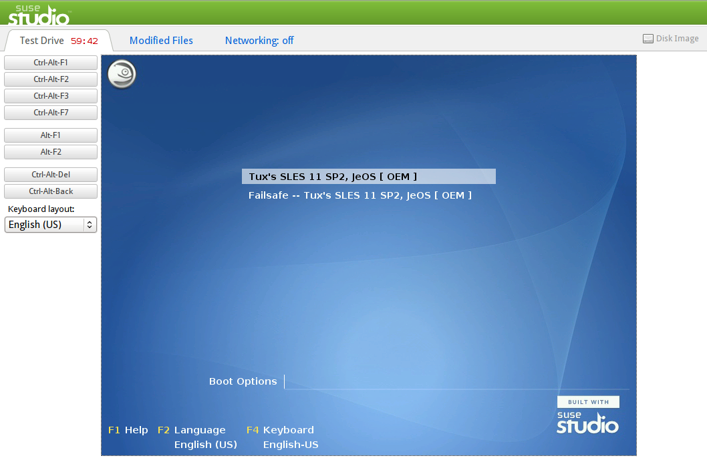

# Testdrive your appliance

SUSE Studio's *Testdrive* enables you to boot and run your appliance
without downloading it.

If you haven't already decided on a default format, "USB stick / hard
disk image" is a good choice for testdrive-based customization. After
building, click "Testdrive" to boot your appliance in the Studio cloud.

You may manipulate or test your appliance via:

1. the browser-based testdrive client.
2. a VNC session.
3. an SSH session.
4. an HTTP or HTTPS connection (for web applications).

If you want to use a VNC session, log in with SSH, or test your web
application (including [WebYaST]), click the "Networking" tab;
this tab displays some explanations how to use these methods.
Click the "Enable Networking" button to turn these features on.

The "Modified Files" tab allows you track and import changes to the file
system made during a testdrive.

[WebYaST]: http://en.opensuse.org/Portal:WebYaST
