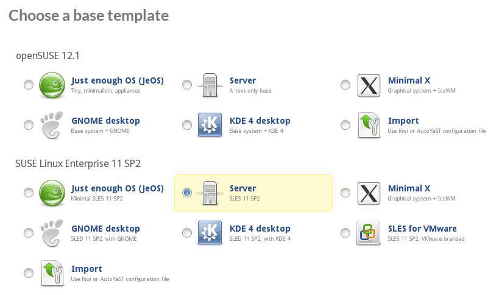
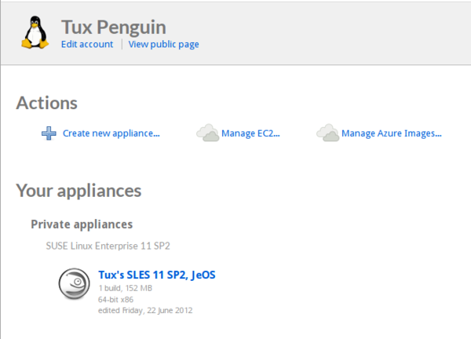

# Selecting a Base Template

After you have logged in to SUSE Studio for the first time, select one of the available base templates, see Figure 2.1. A base template determines the operating system your appliance is based upon. Depending on the server configuration, this can be any of the openSUSE, SUSE Linux Enterprise Desktop, or SUSE Linux Enterprise Server flavours, be it for 32- or 64-bit processor architectures.

*Figure 2.1.: Selecting from Available Base Templates*

If you have already created an appliance, SUSE Studio gives a list of your appliances that have been already built and a list of appliances which are shared with you by others, see Figure 2.2.

*Figure 2.2.: Home Site Displaying Own And Shared Appliances*

To work with appliances, you have three options:

* **Create a New Appliance.** Click *Create new appliance...* and choose a base template. The following sections describe, how to customize the appliance to your needs.
* **Work on Existing Appliances.**  Click an entry on the Your appliances list to work with a saved appliance. If you have not created an appliance yet, the list is empty.
To use a previously saved appliance as a base template, hover the mouse of the entry. Use the Clone link to create a new appliance based on the currently selected one.
* **Clone Shared Appliances.**  Hover the mouse over an entry in the Appliances shared with me by other users list. Entries in this list can only be cloned, not modified. If no users have shared their appliances, this is empty.

Regardless of the method you choose, you always end up on the same welcome page.

