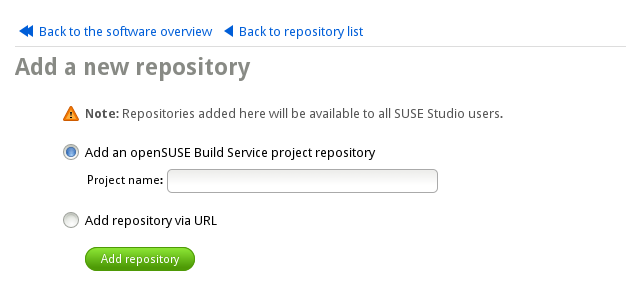

# Adding Software

The next step is to adjust the software selection to your needs. You can add missing software to or remove existing software from your base template. Choose your software from three sources:

1. **From a Preconfigured Base Template.**  Add already available software from your base template. For example, if you choose SUSE Linux Enterprise Server 11/JeOS you can add everything that is available from this release.

2. **From External Repositories.**  Add additional repositories from the openSUSE Build Server or any other URL providing a software collection which is compatible with SUSE Studio and its templates.

3. **Any Compatible RPMs.**  Upload any compatible RPM package from your hard disk or from the Web into SUSE Studio. Make sure it is built for your base template and its architecture is the same as your appliance.

The following subsections give you detailed instructions.

## Adding Software from a Base Template

Base templates are a fixed set of complete products. Depending on the setup of the SUSE Studio server, you can choose among the following templates:

**SUSE Linux Enterprise Server 11 SP1**
Contains version 11 with service pack 1 of SUSE Linux Enterprise Server. Base templates are usually JeOS, Server, VMware, GNOME and KDE desktops.

**SUSE Linux Enterprise Server 10**
Contains version 10 of SUSE Linux Enterprise Server. Base templates are Server, GNOME and KDE desktops.

To create software from your base template, proceed as follows:

1. Click the Software link.

2. If you already know the name of your package, click the *Quick* link and enter the name. If the name exists, it will be automatically inserted into your software list and you are done.

3. If you do not know the exact name, enter the name in the Search packages & patterns text field and press `Enter`. SUSE Studio displays a list names, their version, size, repository, and popularity.

4. Use the *+add* button to incorporate the package into your list of installable software. As each package can depend on other packages, SUSE Studio tries to automatically resolve any dependencies. In such a case, SUSE Studio notifies you about missing packages. This package list is displayed and has to be confirmed to resolve any dependecies.

## Adding Software from External Repositories¶

To add an external repository from the openSUSE Build Server, proceed as follows:

1. Go to the Software link and click Add repositories.... The page displays the available repositories:

2. Enter a search word to reduce the list of shown repositories. Whenever a user adds a repository, the repository will be available for all users. When you found the repository you were looking for, click *Add*.

3. If your repository is not available in the list, click *Import new repository...*. The following page is shown:

4. Choose from a local or a remote source (usually openSUSE Build Server):

* **From openSUSE Build Server.**  Enter the project name. For example, if you use this repository URL [http://download.opensuse.org/repositories/devel:/languages:/python/][obs] your project name is `devel:languages:python`.
* **From URL.**  Enter the URL pointing to your external repository.

## Adding Compatible RPM Packages

If you have downloaded or built an RPM package yourself, upload it to SUSE Studio to use it for your appliance.

---
**Use Only Compatible RPM Packages**

Although SUSE Studio verifies your RPM packages after the upload, it is recommended to roughly check your RPM packages in advance. This quick test safes you bandwidth and time. Check for the following properties:

* Same Architecture: you cannot install a 64-bit RPM package on a 32-bit appliance. The architecture is part of the RPM filename (watch for i586 or x86_64)
* Same Distribution: it is not recommended to install an openSUSE package on a SUSE Linux Enterprise product.
Use YaST to find information about your package or execute the following command:

`rpm -qp --queryformat "%{NAME}: %{DISTRIBUTION} %{ARCH}\n" RPMFILES`

---

Proceed as follows to add an RPM package:

### Procedure 2.1. Uploading an RPM Package

1. Go to the Software link and click *Upload and manage RPMs...*.

2. Select your RPM either from your file systems with Upload RPM... or from a remote source with *Add from the Web (URL)...*.

3. Add as many RPM packages as you want. You can also remove existing packages.

4. Click Back to the software overview to integrate it to your software collection.

5. If you need to add more RPM packages, the previous procedure is a bit cumbersome. In this case, create an archive first and upload it to SUSE Studio. This archive contains all the RPM packages you want to add and can be in tar, tar.gz, tar.bz2, or zip format. Proceed as follows:

### Procedure 2.2. Uploading a ZIP Archive Containing RPM Packages

1. Create a directory `/tmp/RPMs`.

2. Copy all your RPM packages to `/tmp/RPMs`.

3. Open a shell, for example press *Alt+F2* and enter `xterm`.

4. Execute the following commands:   
`cd /tmp/RPMs`  
`zip myrpms.zip *.rpm`

5. Upload the archive as described in Procedure 2.1, "Uploading an RPM Package" and start with Step 2. After a successful upload, the archive name is shown in the list.

[obs]: http://download.opensuse.org/repositories/devel:/languages:/python/