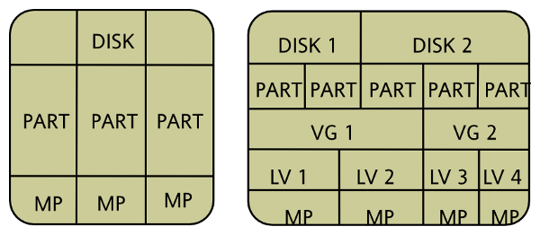

# Changing your Configurations

Use the Configuration link in the SUSE Studio Web page to control several aspects of your appliances:

**General**  
Change your default locale and timezone, configure your network, enable your firewall, and add users and groups.

**Personalize**  
Add new logo and background for your appliance.

**Startup**  
Define your default runlevel and any end user license agreement. Per default this is empty. If you choose this, the user has to agree to your licenses the first time he installs your appliance.

**Server**  
Set up the PostgreSQL or MySQL database configuration.

**Desktop**  
Configure automatic login for users or any program which is automatically started during login.

**Appliance**  
Set up advanced configuration for your appliance as disk, memory, and logical volume manager. Usually for experts.

**Scripts**  
Run custom scripts at the end of your build. Usually for experts.

The following subsections describe some often used scenarios.

## Using Predefined Logos and Background Images

To change the logo or background of your appliances, proceed as follows:

1. Click *Configuration+Personalize*.

2. Select from predefined logos or upload your own.

3. Do the same for the background.

The *Preview* section shows an overview of how your appliance will look like during boot and login.

## Changing Default Locale

The default locale setting is English. If you want to change it, go to Configuration+General and choose your preferred language, keyboard layout, and time zone.

## Adding Users and Groups

If your appliance requires more than the default users root and tux, go to *Configuration+General* and click *Add new user...*. SUSE Studio creates a new line where you can change the login name, an optional user ID, password, group, home directory, and its shell. Add as many users as you want. To remove a user, click the cross icon on the right side.

# Customizing Network Settings

Configure your network settings under *Configuration+General*. SUSE Studio allows to choose from different entries:

**Do not configure network**
Disable the network.

**Configure network during first boot**
Let your network configure during boot.

**Use NetworkManager to configure the network at run-time**
Enable the network through NetworkManager. See [http://www.novell.com/documentation/sles11/book_sle_admin/data/book_sle_admin_pre.html][novell-sle-admin-book] for more information.

**Discover network settings automatically (DHCP)**
Use a DHCP server to get the IP address.

**Manually configure network**
Enter the hostname, IP address, netmask, route, and name servers manually.

## Adding an End User Licence Agreement (EULA)

In case your appliance contains special programs under a certain license, it may be necessary that the user agrees to this license during boot time.

If you want to add a license (EULA) to your appliance, go to *Configuration+Startup* and click the *Add a new EULA* link. Insert your license in the text field. It is possible to enter more licenses, if necessary.

## Customizing Appliance Configuration

If you need to change some aspects in your appliance, such as memory or swap space, go to *Configuration+Appliance*. Configure the disk size and memory for VMware and Xen. Select the memory value from the pop-up menu and insert the needed disk size in the text field. The same is possible with the swap image.

To help to build a Xen host (or Xen hypervisor), check Enable Xen host mode and SUSE Studio installs the packages `xen-kernel`, `xen-tools`, and related packages to the Xen hypervisor. This option is only useful for a disk image format.

The checkbox Enable VMware CD-ROM support is a workaround for a bug in VMware Workstation. This bug causes the host Windows 2003 Server to crash, when CD-ROM support is enabled. Use this option, to enable CD-ROM support in the VMware virtual machine.

## Using LVM for SUSE Studio

The Logical Volume Manager (LVM) is an abstract layer between hard disks, partitions, and file systems. LVM gives the system administrator more flexibility. See the flexibility in Figure 2.3, “Physical Partitioning versus LVM” which compares physical partitioning (left) with LVM segmentation (right).

*Figure 2.3. Physical Partitioning versus LVM*

On the left, one single disk has been divided into three physical partitions (PART), each with an assigned mount point (MP) so that the operating system can access them. On the right, two disks have been divided into two and three physical partitions. Two LVM volume groups (VG 1 and VG 2) have been defined. VG 1 contains two partitions from DISK 1 and one from DISK 2. VG 2 contains the remaining two partitions from DISK 2. In LVM, the physical disk partitions that are incorporated in a volume group are called physical volumes (PVs). Within the volume groups, four logical volumes (LV 1 through LV 4) have been defined, which can be used by the operating system via the associated mount points. The border between different logical volumes do not have to be aligned with any partition border. See the border between LV 1 and LV 2 in this example

Find more about the details of LVM in [http://www.novell.com/documentation/sles11/stor_admin/data/lvm.html][novell-lvm]

SUSE Studio supports LVM with one volume group. To create your individual logical volume, proceed as follows:

1. Create your appliance as described in Chapter 2, Creating Appliances.

2. Go to *Configuration+Appliance*.

3. Enable the *Configure LVM* checkbox.

4. Enter the name or the volume group name, default is `systemVG`.

5. Enter the volume mount path and its size. You need at least one entry. More can be added with the *Add new LVM volume...* link.

6. Build your appliance.

[novell-sle-admin-book]: http://www.novell.com/documentation/sles11/book_sle_admin/data/book_sle_admin_pre.html
[novell-lvm]: http://www.novell.com/documentation/sles11/stor_admin/data/lvm.html