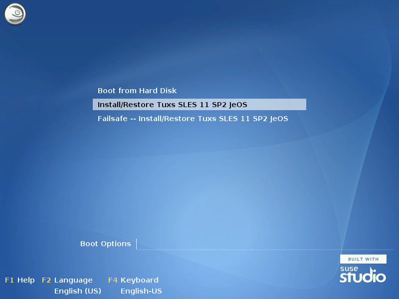
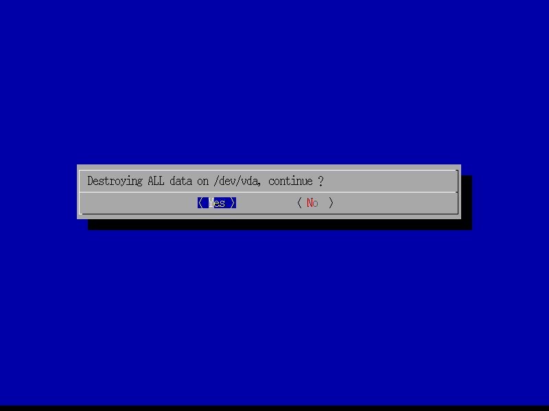
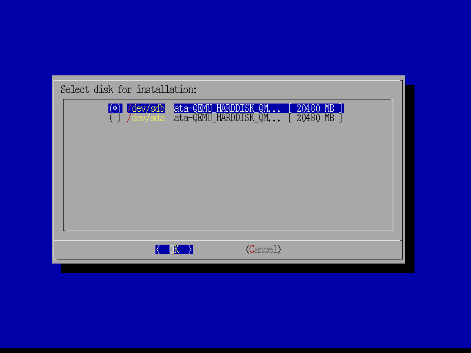

# Preload ISO

A common use case in Studio is the creation of hard drive images for preloading
systems. This is great for setting up a computer lab or a server farm,
where you want all systems to have the same software and configuration. It is
also a step that system hardware vendors (OEMs/IHVs) often include in their
production process.

SUSE Studio makes the creation of these images easy, but it's a bit tricky
to get them onto your target system. One way is to use a boot disk, like a Live
CD/DVD or Live USB stick, and then dd the image to the target hard drive. This
can be largely automated with a smart boot image that can, with a
bit of scripting and setup, automatically load the image from a server via the
network and write it to the target drive (eg. dd over netcat). Unfortunately
this does not work in networkless environments and may not be worth the effort
if applied to only a couple of systems.

For such cases we have added the new Preload ISO build format to facilitate this
process. A preload ISO is simply a Live CD/DVD that contains the preload hard
disk image. When booted, it overwrites the target disk (after user
confirmation), verifies the checksum, then boots directly into the freshly
loaded system. A word of warning - this format is meant for preloading and hence
will overwrite all data on the target drive. Do not use this on your system
unless you want to perform a clean installation! It is currently available for
all base systems except SLE10.

Here's how it looks like in Testdrive. Choose the "Install/Restore" option when
booting:

There is a confirmation prompt before it overwrites the target drive:

If you have more than one disk available, you can choose from the list:

We think this will be a very useful format for system admins, ISVs/IHVs, and
other users that require preloading. To those who have been asking for this in
Studio: We've heard you, and now it's here!
