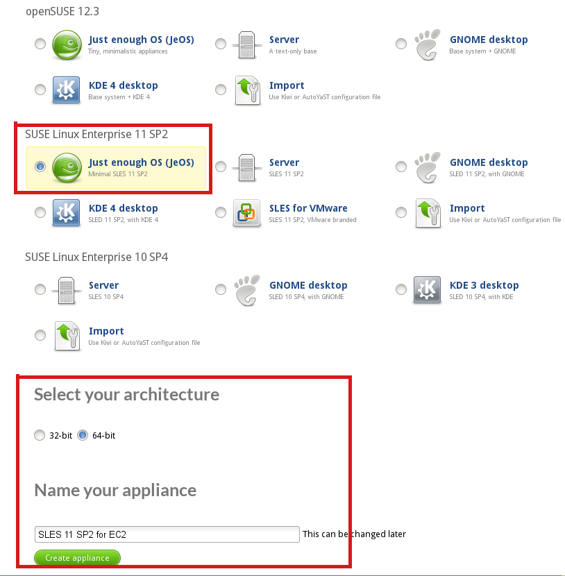
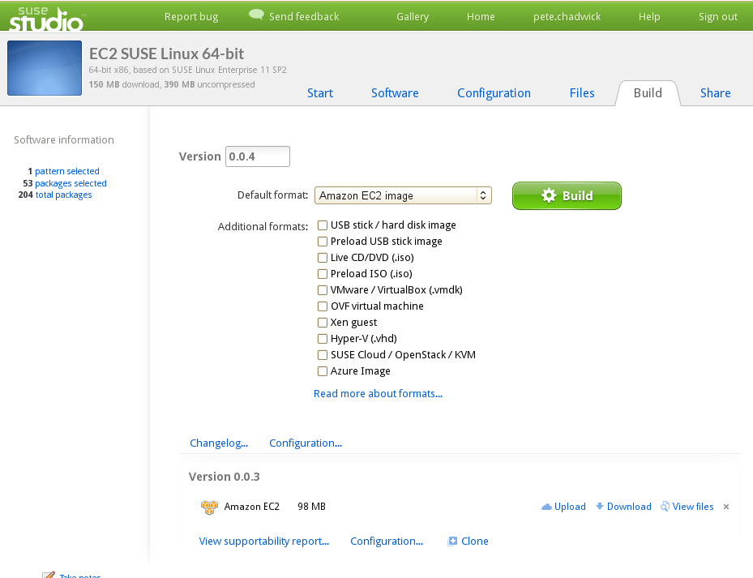
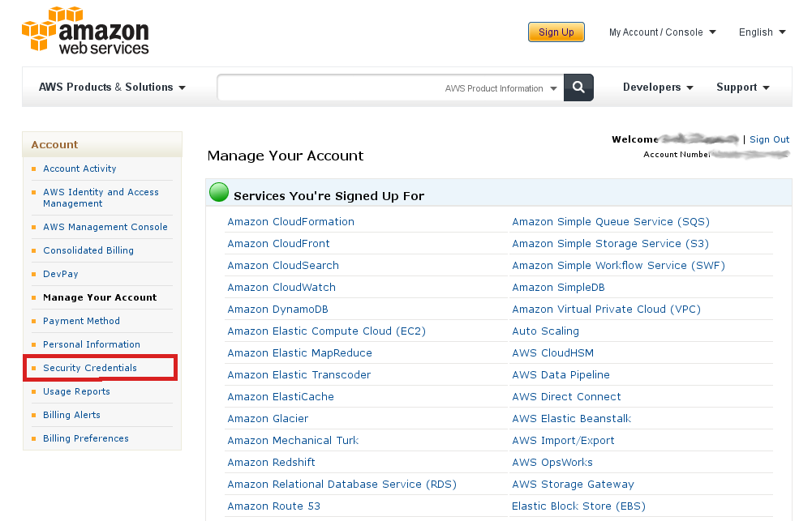
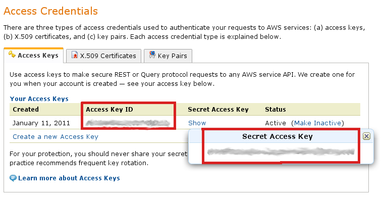
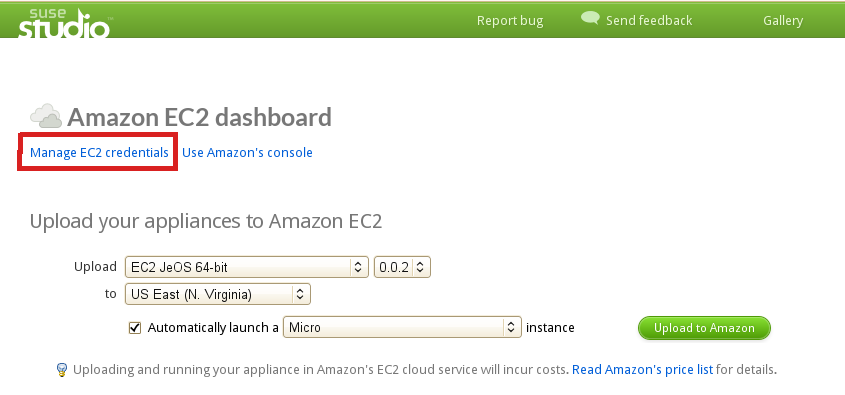
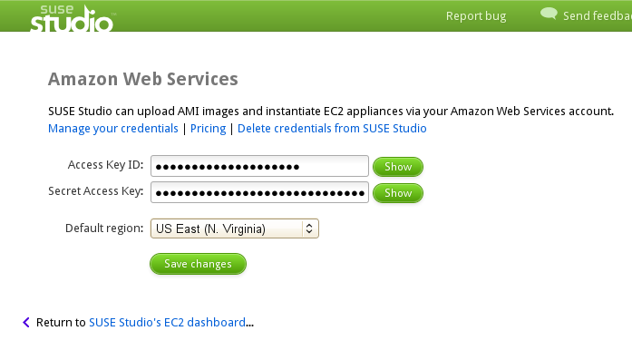
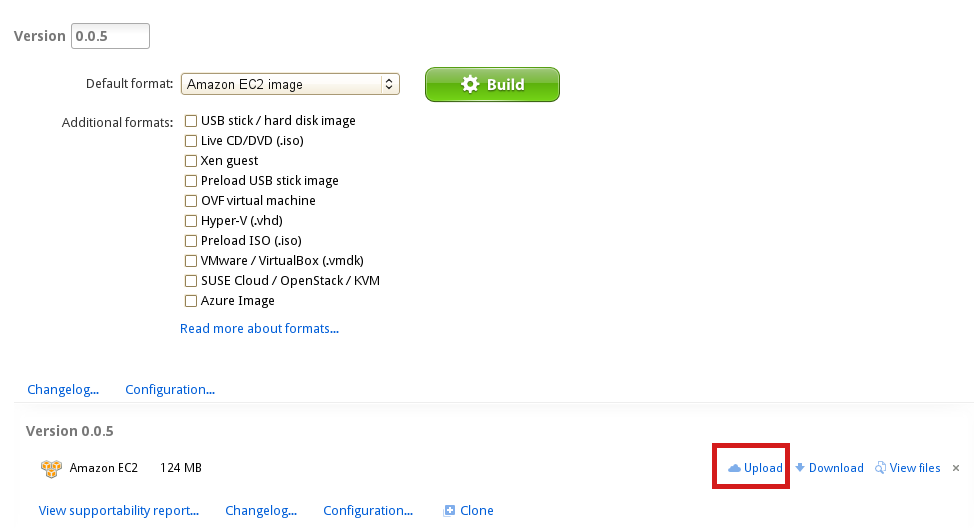

# Amazon EC2

## Using SUSE® Studio to Build and Deploy Amazon EC2 Format Images

Regular users of SUSE Studio have long known about the [Amazon Elastic
Compute Cloud (EC2)][EC2] build format that is available for SUSE Linux
Enterprise Server. This makes it easy to build customized server images for
Amazon EC2 in SUSE Studio and directly deploy them into your Amazon Web
Services account! Let's learn how the magic happens.

### Introducing Amazon EC2

If you're new to [Amazon EC2][EC2], it's a web service hosted by Amazon
that provides dynamically scalable computing capacity.
It is one model of [cloud computing] that is often referred to as
*Infrastructure as a Service* (IaaS).
EC2 allows you to rent reliable computing resources (eg. CPU, memory, disk
storage) in a highly flexible and affordable manner, with prices starting
at just several cents per hour per instance.
These resources can be quickly scaled up or down on demand, reducing or
even eliminating the need for companies to buy and maintain expensive
server farms in-house.
Before we proceed with building an EC2 image in SUSE Studio, there's some
Amazon specific terminology we should clarify.
Before launching a workload in EC2, you must first create an Amazon Machine
Image (AMI).
SUSE has found that EBS backed images make sense for most use cases and
have automated the process to build and upload SUSE Linux Enterprise Server
images into EBS backed AMIs.

### Building Amazon EC2 images with SUSE Studio

The easiest way to get started is to find an existing EC2 image in SUSE
Gallery, such as this [LAMP Server appliance].
But, let's walk through the steps to create one from scratch.
First, login to SUSE Studio and create a new appliance based on SUSE
Linux Enterprise Server 11 SP2 JeOS.
This template gives you the most flexibility to add features while keeping
the image size low.
Choose your preferred architecture.
The selection of 32-bit or 64-bit architecture depends on the instance size
that you want to use on EC2.
All EC2 instance types support 64-bit architecture, so this will provide
the most flexibility if you need to launch on larger instances after
testing.
Change the default appliance name, and hit "Create appliance".

You will now be in the appliance editor interface where you can perform
software selection and configuration, but we'll skip that for now and jump
to the Build tab.
(For an overview of Studio, visit the [quickstart] guide.)

Change the default image format to "Amazon EC2 image":

In addition to formatting the image for use on Amazon, there are a number
of packages that will be added during the build process to ensure that your
image will run and receive updates when you launch on EC2.
Once you're satisfied with the configuration, hit "Build".
It usually takes only about five minutes (!!) for the build to complete.

### Uploading an AMI to your Amazon account from the Studio-built image

Once the Build is complete, you can upload the image to EC2.
However, before proceeding you will first need to add your AWS Access
Credentials to Studio.
To find those, log in to your AWS account and select “Security Credentials”
from the left side bar.

This will take you to this Access Credentials screen.
If you have not created credentials, you can do that now.
You have to click “Show” to see the secret key.

Then you need to go to the “Manage EC2 credentials” screen in Studio which
can be done from the Amazon EC2 dashboard in Studio.

This action will take you to this screen, where you input the access
credentials from Amazon.

You are now ready to upload your image directly from the Studio Build
screen.

After pressing upload, Studio will now take you back to the EC2 Dashboard.

Once there you will need to specify in which AWS region you want to put the
image.
If you want to have the image in more than one region, instead of doing
multiple uploads, it is faster to upload the image to one region and then
log into to AWS and copy the image using the AWS management console.
You can optionally launch the instance as soon as it is uploaded, but we
recommend using the AWS management console for launching and monitoring
your instances.
Once you have selected the region, press “Upload to Amazon” to start the
process.

It will take a few minutes, but once the image is loaded, it will appear in
your AWS management console as a private AMI.
And just like that you are now ready to begin using your new image in
Amazon EC2.

[EC2]: http://aws.amazon.com/ec2/
[cloud computing]: http://www.youtube.com/watch?v=ZdidjWZBpno
[LAMP Server appliance]: http://susegallery.com/a/n0rKOx/lamp-server-32bit--2
[quickstart]: ../quickstart/index.html

